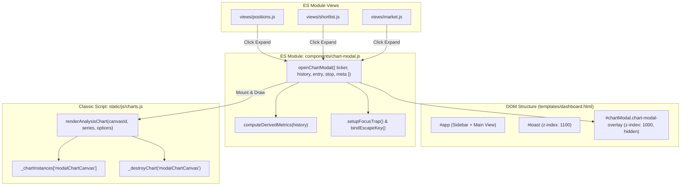

# Engineering Council Design Proposal: Massive Chart & Deep Analysis Subsystem

**Classification**: HARD-classified new UI subsystem  
**Target Application**: Native desktop window (`pywebview` / macOS Cocoa WebKit) + vanilla JS SPA (`Chart.js 4.4.7`)  
**Scope**: Investigation and architectural proposal (no files modified)

---

## 1. Concrete UI Pattern: "Massive Window" in a Single-Window pywebview App

### The Constraint
[`mac_app/main.py`](file:///Users/badripratti/Desktop/stock-screener/mac_app/main.py#L57-L63) launches a single native window (`1440x900`, minimum `900x600`) without a `js_api` bridge or multi-window configuration. Furthermore, during development, the application runs directly in standard web browsers via [`dashboard.py`](file:///Users/badripratti/Desktop/stock-screener/dashboard.py#L678-L681).

### Evaluation of Candidates

| Candidate Pattern | Feasibility | Desktop UX | Trade-offs & Verdict |
| :--- | :--- | :--- | :--- |
| **A. Secondary OS Window (`webview.create_window`)** | ❌ Impractical | High | Requires modifying Python runtime, adding two-way IPC between JS and Python, doesn't work in browser dev mode, and risks WebKit crash hazards under macOS Cocoa fork safety ([`OBJC_DISABLE_INITIALIZE_FORK_SAFETY`](file:///Users/badripratti/Desktop/stock-screener/mac_app/main.py#L20-L27)). **Rejected.** |
| **B. Dedicated Hash Route (`#/analyze/:ticker`)** | ⚠️ High Friction | Poor | Destroys current browse context. Navigating away from [`views/market.js`](file:///Users/badripratti/Desktop/stock-screener/static/js/views/market.js#L218-L235) or [`views/shortlist.js`](file:///Users/badripratti/Desktop/stock-screener/static/js/views/shortlist.js#L98-L116) resets scroll position, table sorting, and tab selection (e.g. Sell tab vs Buy tab). **Rejected.** |
| **C. Full-Viewport Modal Overlay (`role="dialog"`)** | ✅ Optimal | Native App Feel | Fixed-position overlay (`inset: 20px`, `z-index: 1000`), dark backdrop blur (`rgba(10, 11, 16, 0.85)`). On a 1440x900 window, yields a chart canvas of **~1300px × 560px** (over **12×** the area of the cramped 180px inline card). Preserves background scroll, active tabs, and list state upon closing. Works identically in pywebview and browser. **Selected.** |

### Selected Architecture
A **Full-Viewport Modal Overlay** attached as a top-level singleton in [`templates/dashboard.html`](file:///Users/badripratti/Desktop/stock-screener/templates/dashboard.html). It takes 94vw × 90vh (clamped between 860px–1400px width and 540px–820px height), completely unconstraining the visual canvas while keeping the screening context alive beneath it.

---

## 2. Scope of "Other Analysis" Under Current Data Constraints

### The Data & Library Realities
1. **Data Constraint**: [`scripts/fetch_price_history.py`](file:///Users/badripratti/Desktop/stock-screener/scripts/fetch_price_history.py#L25-L30) and [`src/analysis/position_manager.py`](file:///Users/badripratti/Desktop/stock-screener/src/analysis/position_manager.py#L189-L193) fetch only `~180` trading days of **daily close prices**: `[{"date": "YYYY-MM-DD", "close": 123.45}]`. There are no Open, High, Low, or Volume values.
2. **Library Constraint**: The app vendors standard Chart.js 4.4.7 in [`static/js/vendor/chart.umd.min.js`](file:///Users/badripratti/Desktop/stock-screener/static/js/vendor/chart.umd.min.js#L7-L10). Chart.js core **does not support candlestick or OHLC charts**. Adding candlesticks would require vendoring `chartjs-chart-financial` plus a date adapter (like `chartjs-adapter-date-fns`).

### Recommended Scope for THIS Sprint: Client-Side Derived Technical Analytics

We can deliver immense analytical depth immediately with **zero backend schema changes and zero new vendor dependencies**, perfectly aligned with the app's Weinstein Stage 2 momentum philosophy:

```
+----------------------------------------------------------------------------------------------------+
| NVDA · Full Price Analysis                                                    [1M] [3M] [6M] [ALL]  |
| Price: $128.50  ·  180d Change: +42.8%  ·  180d High: $140.76 (-8.7%)  ·  SMA 50: $118.20 (+8.7%)  |
+----------------------------------------------------------------------------------------------------+
| [X] Price  [X] SMA 20  [X] SMA 50  [X] 180d High/Low Band  [X] Your Entry ($110)  [X] Stop ($102)   |
|                                                                                                    |
|   140 |-----------------------------+----------------- (180d High: $140.76)                         |
|       |                           ./ \                                                             |
|   120 |..................../~\.../....\......------- (SMA 20: Fast trend)                          |
|       |                   /   \ /      \                                                           |
|   110 |------------------/-----\--------\----------- (Your Entry: $110.00)                         |
|   102 | - - - - - - - - / - - - \ - - - -\- - - - -  (Recommended Stop: $102.00)                   |
|       |                /         \        \                                                        |
|    90 |---------------+-----------+--------+-------- (180d Low: $88.20)                            |
|       +--------------------------------------------------------------------------------------------+
|        Apr 2026                 Jun 2026                 Aug 2026                         Sep 2026 |
+----------------------------------------------------------------------------------------------------+
```

#### Included in This Sprint:
1. **Moving Average Overlays (Client-Side Calculated)**:
   - **20-day SMA** (Short-term momentum / pullback benchmark; styled with `--color-warning` / yellow).
   - **50-day SMA** (Intermediate trend baseline, matching [`src/analysis/position_manager.py`](file:///Users/badripratti/Desktop/stock-screener/src/analysis/position_manager.py#L182-L198) where continuation entries are flagged when pulling back to the rising 50 SMA; styled with `--color-accent-secondary` / purple).
2. **Key Metric Analytics Strip (Header of Modal)**:
   - Current Price & Cumulative % Change over window.
   - 180-Day Range & Drawdown (`180d High`, `180d Low`, and `% off peak`).
   - Moving average spread (`Price vs 50 SMA`: e.g. `+8.7% extended` or `-2.1% below`).
3. **Interactive Visual Toggles (Legend / Controls)**:
   - Instant checkbox/pill toggles to show/hide Price, 20 SMA, 50 SMA, 180d Range Channel, Entry Price, and Stop Loss.
4. **Timeframe Slicing (Client-Side Array Slice)**:
   - Pill buttons: `1M` (last 21 bars), `3M` (last 63 bars), `6M` (last 126 bars), `ALL` (180 bars). No network request required.

#### Explicitly Deferred to Future Sprints:
- **OHLCV Candlesticks & Volume Histogram**: Requires rewriting [`scripts/fetch_price_history.py`](file:///Users/badripratti/Desktop/stock-screener/scripts/fetch_price_history.py#L25-L30) and [`src/analysis/position_manager.py`](file:///Users/badripratti/Desktop/stock-screener/src/analysis/position_manager.py#L189-L193), invalidating all existing ad-hoc cache files, and vendoring `chartjs-chart-financial`.
- **RSI / MACD Sub-Charts**: Adds clutter; secondary pane synchronization in Chart.js adds substantial code weight.

---

## 3. Trigger Mechanism and Inline Chart Coexistence

### Should the small inline chart still exist?
**Yes.** The small inline chart serves rapid "glanceability" across multiple cards (e.g. comparing 3 stocks side-by-side on the shortlist). Replacing it entirely with a modal forces modal open/close fatigue for quick visual checks.

### Recommended Dual Triggering
1. **From the Inline Chart Wrapper (Primary Discoverability)**:
   - When an inline chart is open, a new `⤢ Expand` icon button appears in the top-right corner of the `.position-chart-wrap`.
   - In addition, clicking the inline `<canvas>` itself triggers the big modal (`cursor: zoom-in`). This directly answers the user’s frustration ("the graph that pops up is too small").
2. **Directly from Row / Card Action (Shortcut)**:
   - Add a subtle expand icon button directly next to the existing toggle button:
     [`chartToggleButtonHTML`](file:///Users/badripratti/Desktop/stock-screener/static/js/core/ui-helpers.js#L7-L9) renders the inline toggle (`📈`), and a paired button [`chartExpandButtonHTML`](file:///Users/badripratti/Desktop/stock-screener/static/js/core/ui-helpers.js) renders the expand trigger (`⤢`).
   - In [`static/js/views/market.js`](file:///Users/badripratti/Desktop/stock-screener/static/js/views/market.js#L365), where table columns are tight, clicking the chart icon or pressing `Alt+Click` opens the modal directly, and the expanded row contains a prominent `Expand to full analysis` button.

---

## 4. Concrete Implementation Architecture



### Module Boundaries & Code Placement
1. **Modal Singleton HTML**: Defined in [`templates/dashboard.html`](file:///Users/badripratti/Desktop/stock-screener/templates/dashboard.html) immediately after `<div class="toast" id="toast">`:
   ```html
   <div id="chartModal" class="chart-modal-overlay" hidden role="dialog" aria-modal="true" aria-labelledby="modalTickerTitle">
     <div class="chart-modal-dialog">
       <header class="chart-modal-header">
         <div>
           <div class="chart-modal-title-row">
             <h2 id="modalTickerTitle" class="ticker"></h2>
             <span id="modalMetaBadge"></span>
           </div>
           <div id="modalMetricsStrip" class="chart-modal-metrics"></div>
         </div>
         <div class="chart-modal-actions">
           <div class="chart-modal-timeframes" role="group" aria-label="Timeframe">
             <button class="btn btn-sm tf-btn" data-tf="21">1M</button>
             <button class="btn btn-sm tf-btn" data-tf="63">3M</button>
             <button class="btn btn-sm tf-btn" data-tf="126">6M</button>
             <button class="btn btn-sm tf-btn active" data-tf="180">ALL</button>
           </div>
           <button class="btn chart-modal-close" id="chartModalClose" aria-label="Close analysis modal">✕</button>
         </div>
       </header>
       <div class="chart-modal-toolbar" id="modalDatasetToggles"></div>
       <div class="chart-modal-canvas-wrap">
         <canvas id="modalChartCanvas"></canvas>
       </div>
     </div>
   </div>
   ```
2. **ES Module Coordinator**: Create `static/js/components/chart-modal.js`:
   - Pure math helpers: `computeSMA(closes, period)`, `computePriceStats(history)`.
   - Modal lifecycle: `openChartModal({ ticker, history, entry, stop, meta, triggerEl })`, `closeChartModal()`.
   - Event listeners: Timeframe slicing, SMA visibility toggles, keyboard focus trapping, and ESC handling.
3. **Chart Rendering in Classic Script**: Add [`renderAnalysisChart(canvasId, data, options)`](file:///Users/badripratti/Desktop/stock-screener/static/js/charts.js) inside [`static/js/charts.js`](file:///Users/badripratti/Desktop/stock-screener/static/js/charts.js):
   - Integrates with [`_destroyChart(canvasId)`](file:///Users/badripratti/Desktop/stock-screener/static/js/charts.js#L33-L38) to guarantee clean instance cleanup.
   - Configures smooth multi-dataset scaling, dual crosshair hover plugin, and design token integration ([`CHART_COLORS`](file:///Users/badripratti/Desktop/stock-screener/static/js/charts.js#L16-L25)).

---

## 5. Relevant Files and Modules to Touch

1. [`templates/dashboard.html`](file:///Users/badripratti/Desktop/stock-screener/templates/dashboard.html): Add top-level `#chartModal` markup.
2. [`static/css/dashboard.css`](file:///Users/badripratti/Desktop/stock-screener/static/css/dashboard.css):
   - Modal overlay styling (`.chart-modal-overlay`, `.chart-modal-dialog`, `.chart-modal-canvas-wrap`).
   - Fix `.toast` z-index (raise from `100` to `1100`).
   - Modal canvas wrapper explicit height rules (`calc(100vh - 280px)`, min `380px`).
   - Responsive rules for `<= 760px` breakpoint.
3. [`static/js/charts.js`](file:///Users/badripratti/Desktop/stock-screener/static/js/charts.js):
   - Add `renderAnalysisChart(canvasId, seriesData, displayOptions)`.
4. `static/js/components/chart-modal.js` (**NEW**):
   - Core controller for modal lifecycle, focus management, indicator math, and timeframe filtering.
5. [`static/js/core/ui-helpers.js`](file:///Users/badripratti/Desktop/stock-screener/static/js/core/ui-helpers.js):
   - Add `chartExpandButtonHTML(ticker)` and wire expand triggers inside `wireChartToggles`.
6. [`static/js/views/positions.js`](file:///Users/badripratti/Desktop/stock-screener/static/js/views/positions.js):
   - Pass series data and connect expand button to `openChartModal`.
7. [`static/js/views/shortlist.js`](file:///Users/badripratti/Desktop/stock-screener/static/js/views/shortlist.js):
   - Connect expand button on shortlist cards.
8. [`static/js/views/market.js`](file:///Users/badripratti/Desktop/stock-screener/static/js/views/market.js):
   - Connect expand button on Buy and Sell signal rows.
9. `tests/js/test_chart_modal.js` (**NEW**):
   - Automated Node test for indicator calculations, timeframe slicing, and ARIA modal state.

---

## 6. Alternative Approaches Considered and Rejected

1. **Native macOS Secondary Window via pywebview**:
   - *Why rejected*: `mac_app/main.py` runs a single Flask/WebKit thread. Multi-window in pywebview lacks cross-window state synchronization, requires a Python JS API bridge that breaks in normal browser mode, and triggers known Cocoa WebKit crash hazards under fork safety.
2. **Dedicated Full-Page Route (`#/chart/:ticker`)**:
   - *Why rejected*: Navigating away tears down the screening DOM, resetting scroll position, table sorting, and lazily rendered Sell tabs.
3. **Native HTML5 `<dialog>` Element**:
   - *Why rejected*: pywebview uses Cocoa WebKit (Safari engine). `<dialog>::backdrop` and fixed-positioning inside flex containers have documented rendering glitches and focus bugs in embedded WebKit builds. A CSS-controlled `div` overlay with explicit `aria-modal="true"` and `role="dialog"` provides 100% predictable behavior across all platforms.
4. **Third-Party Chart Embed (e.g. TradingView Widget iframe)**:
   - *Why rejected*: Violates local-only offline privacy guarantees, requires external internet connectivity, cannot plot the user's custom entry and stop points, and fails when sandboxed inside pywebview.

---

## 7. Risks and Architectural Mitigations

### 1. Modal Focus-Trapping and Keyboard Accessibility
- **Risk**: User tabs out of the modal into hidden background links; pressing Escape does nothing; closing the modal leaves focus lost on `<body>`.
- **Mitigation**:
  - Store `_lastFocusedElement = document.activeElement` on open.
  - On open, set focus to the modal's Close button or active timeframe pill.
  - Bind `keydown` on modal: `Escape` calls `closeChartModal()`; `Tab` traps focus cyclically between the first and last focusable elements (`button, [tabindex="0"]`).
  - On close, restore focus safely via `_lastFocusedElement?.focus()`.

### 2. Z-Index and Stacking Contexts
- **Risk**: In [`static/css/dashboard.css`](file:///Users/badripratti/Desktop/stock-screener/static/css/dashboard.css#L359), `.toast` has `z-index: 100`. The sticky sidebar ([`static/css/dashboard.css#L85`](file:///Users/badripratti/Desktop/stock-screener/static/css/dashboard.css#L85)) has `position: sticky`.
- **Mitigation**:
  - Set `.chart-modal-overlay` to `z-index: 1000`.
  - Bump `.toast` to `z-index: 1100` so notifications (e.g. auto-sync completion) remain legible above the modal.

### 3. Inline Chart vs. Modal Chart Lifecycle Interference
- **Risk**: If the modal reuses canvas IDs or tampers with the inline chart instance, the inline chart breaks or throws: `Canvas is already in use. Chart with id '0' must be destroyed...`
- **Mitigation**:
  - The modal uses a dedicated, isolated canvas ID: `modalChartCanvas`.
  - The modal never touches the inline chart's canvas ID (`pos-chart-AAPL`) or the [`_openCharts`](file:///Users/badripratti/Desktop/stock-screener/static/js/core/ui-helpers.js#L5) registry.
  - [`static/js/charts.js`](file:///Users/badripratti/Desktop/stock-screener/static/js/charts.js#L33-L38)'s `_destroyChart('modalChartCanvas')` is called unconditionally before rendering and on modal close.

### 4. Chart.js Aspect Ratio Collapse Trap
- **Risk**: As noted in [`static/css/dashboard.css`](file:///Users/badripratti/Desktop/stock-screener/static/css/dashboard.css#L164-L166):
  `Chart.js's maintainAspectRatio:false collapses to 0px height inside a flex/grid parent without an explicit height on the wrapper`.
- **Mitigation**:
  - `.chart-modal-canvas-wrap` must have an explicit computed height:
    `height: calc(100vh - 280px); min-height: 380px; max-height: 620px; position: relative; width: 100%;`
  - In Chart.js config, set `responsive: true` and `maintainAspectRatio: false`.

---

## 8. Edge Cases

1. **Short Price History (e.g. Recent IPO / Low Liquidity)**:
   - If a stock has only 15 daily bars, a 20-day or 50-day SMA produces `NaN`.
   - *Mitigation*: The indicator generator checks `history.length < period`. If true, it pads leading values with `null` and marks the dataset as `hidden: true` or displays an informational badge: `50 SMA: Insufficient history (15/50 days)`.
2. **Zero Price History (`history = []`)**:
   - *Mitigation*: Modal detects empty history and displays the standard empty state component ([`emptyStateHTML`](file:///Users/badripratti/Desktop/stock-screener/static/js/components/empty-state.js)) instead of attempting to construct a Chart.js instance.
3. **Rapid Ticker Clicks / Race Conditions**:
   - If a user rapidly clicks different expand buttons while animations or async price loads are pending.
   - *Mitigation*: Synchronously destroy `_destroyChart('modalChartCanvas')` and cancel any pending RAF/transition before opening the new ticker.
4. **Background Live Refresh Ticking While Modal is Open**:
   - Every 90 seconds, [`static/js/core/refresh.js`](file:///Users/badripratti/Desktop/stock-screener/static/js/core/refresh.js#L7) triggers live updates. In Positions, [`renderPositionsResults`](file:///Users/badripratti/Desktop/stock-screener/static/js/views/positions.js#L126-L183) completely rewrites `document.getElementById('pos-results').innerHTML`.
   - *Mitigation*: Because `#chartModal` is a top-level body child outside of `#content`, background live refreshes will **not** wipe the modal. Furthermore, when the modal closes, `document.contains(_lastFocusedElement)` is verified before returning focus; if the trigger card was replaced by live refresh, focus safely falls back to `#content`.

---

## 9. Testing Strategy (Aligned with Existing Plain Node.js Pattern)

Following the existing pattern in [`tests/js/test_market_signal_extras.js`](file:///Users/badripratti/Desktop/stock-screener/tests/js/test_market_signal_extras.js) and [`tests/js/test_shortlist_empty_state.js`](file:///Users/badripratti/Desktop/stock-screener/tests/js/test_shortlist_empty_state.js), testing is split cleanly between headless Node assertions and manual verification:

### Automated Headless Tests (`tests/js/test_chart_modal.js`)
Run via `node tests/js/test_chart_modal.js` with zero dependencies:
1. **Mathematical Integrity of Derived Analytics**:
   - Assert `computeSMA(closes, 20)` matches known rolling sum values.
   - Assert leading `period - 1` entries are strictly `null` (not `NaN` or `undefined`).
   - Assert input with fewer days than the period returns all `null`s without throwing.
   - Assert `computePriceStats(history)` correctly identifies max/min, % change, and drawdown.
2. **Timeframe Slicing**:
   - Assert slicing `1M` extracts exactly 21 bars, `3M` extracts 63 bars, and bounds are clamped safely if total bars < requested.
3. **DOM & ARIA Structural Assertions**:
   - Assert modal template contains `role="dialog"`, `aria-modal="true"`, and `aria-labelledby`.
   - Assert canvas ID is strictly `modalChartCanvas`.
   - Assert close button has an accessible `aria-label`.

### Manual Browser & Pywebview Verification Checklist
1. **Visual Scale**: Open on standard window size (`1440x900`) and verify the canvas expands to ~1300px × 560px.
2. **Resize Responsiveness**: Drag window corner to minimum size (`900x600`) and verify Chart.js resizes smoothly without collapsing to 0px height.
3. **Focus Loop & Escape Key**:
   - Press Tab repeatedly; verify focus never leaves the modal.
   - Press `Escape`; verify modal closes instantly and focus returns to the exact trigger button.
4. **Inline Chart State Preservation**:
   - Open an inline chart on Shortlist card #2.
   - Click Expand to open the big modal.
   - Close the modal.
   - Verify inline chart #2 remains open, rendered, and undamaged.

---

## 10. Subtle Traps Another Engineer Might Easily Miss

1. **`charts.js` is a Classic Script, Not an ES Module**:
   - In [`templates/dashboard.html#L68-L69`](file:///Users/badripratti/Desktop/stock-screener/templates/dashboard.html#L68-L69), `charts.js` is loaded via a standard `<script>` tag before `dashboard.js` (`type="module"`).
   - Functions like `renderPositionChart` and `_destroyChart` are attached to `window`.
   - An engineer attempting to do `import { renderPositionChart } from '../charts.js'` in an ES module will trigger a runtime `SyntaxError: Unexpected token 'export'`.
2. **Data Structure Discrepancies Across the Three Views**:
   - In [`positions.js`](file:///Users/badripratti/Desktop/stock-screener/static/js/views/positions.js#L186), `entry_price` and `recommended_stop` are real portfolio values.
   - In [`shortlist.js`](file:///Users/badripratti/Desktop/stock-screener/static/js/views/shortlist.js#L138), `entry` and `stop` are `null`.
   - In [`market.js`](file:///Users/badripratti/Desktop/stock-screener/static/js/views/market.js#L368), Buy signals have `stop_loss` but no user entry price; Sell signals have `breakdown_level` but no stop loss.
   - The analysis modal must treat reference lines as strictly optional. If `entryPrice` or `stopLoss` is null, the corresponding datasets and legend items must be omitted entirely rather than plotting flat zero lines.
3. **Detached Focus Target After Live Refresh**:
   - If a user spends more than 90 seconds analyzing a position in the modal, [`refreshPositionsLive`](file:///Users/badripratti/Desktop/stock-screener/static/js/views/positions.js#L62-L68) will have replaced the underlying HTML card. Attempting `_lastFocusedElement.focus()` on close will silently fail because that DOM node is no longer attached to the document.
4. **Modal Canvas Re-use Error**:
   - Calling `new Chart(ctx, ...)` on `modalChartCanvas` when switching tickers without calling `_destroyChart('modalChartCanvas')` throws a fatal Chart.js error: `"Canvas is already in use. Chart with id 'X' must be destroyed before the canvas can be reused."`
5. **Toast Hidden Behind Modal**:
   - Raising `.chart-modal-overlay` to `z-index: 1000` without increasing `.toast`'s `z-index: 100` makes all background sync/job notifications invisible while the modal is open.

---

### Council Recommendation Summary
Adopt the **Full-Viewport Modal Overlay** architecture with **Client-Side Derived Technical Analytics (20/50 SMA, 180d Range Channel, and Timeframe Slicing)**. This directly satisfies the user's desire for a "massive window for other analysis" immediately, requires zero backend or vendor changes, respects the desktop pywebview constraints, and maintains the stability and performance of the existing screener codebase.
