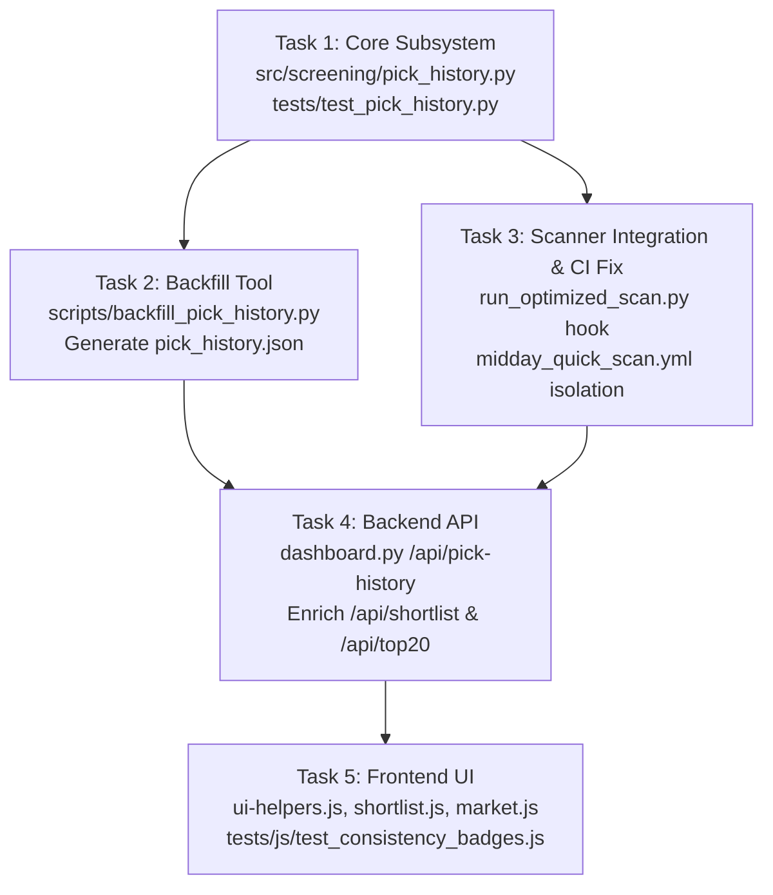

# Engineering Council Design Proposal: Persistent Pick-History Ledger & Consistency Engine

**Council Classification:** HARD (New persistent data subsystem + CI/CD workflow architecture + API + UI)  
**Status:** Investigation & Design Proposal Only (No repository files modified)  
**Target Repository:** `/Users/badripratti/Desktop/stock-screener`

---

## 1. Problem Understanding & Measurable Consistency Stats

### The Problem
The screener pipeline currently computes daily picks from scratch and clobbers `data/daily_scans/shortlist_latest.json` (Top 5) and `data/daily_scans/top20_latest.json` (Top 20) on each run. There is no historical memory of past picks. The user cannot see whether a recommended ticker is a one-hit wonder or a persistent market leader that has repeatedly qualified across multiple trading days (e.g., LILA appearing 5 out of 5 scan days vs. a stock that appeared once and disappeared).

### Defining "A Day" & The Weekend/Holiday Streak Bug
In [`scripts/fetch_momentum_status.py`](file:///Users/badripratti/Desktop/stock-screener/scripts/fetch_momentum_status.py#L104-L113), the existing streak logic computes:
```python
last_seen = date.fromisoformat(existing['last_seen'])
gap_days = (today - last_seen).days
if gap_days == 1:
    existing['days'] = existing.get('days', 1) + 1
else:
    existing['since'] = today_str
    existing['days'] = 1
```
**Fatal Flaw:** Friday to Monday has `gap_days = 3`. Under calendar-day math, **every single stock's streak is forcibly reset to 1 every Monday morning**. Similarly, any NYSE market holiday (e.g. Labor Day, Thanksgiving) creates a 4-day gap and resets streaks.

**Precise Definition for Pick History:**
1. **A "Day" is a Trading Day Scan Event:** Streaks and consistency metrics must operate on the **ordered sequence of official daily screening dates** $[D_1, D_2, \dots, D_M]$, **not calendar days**.
2. **Weekend & Holiday Invariance:** Friday ($D_{i}$) to Monday ($D_{i+1}$) is a consecutive scan transition with zero missed scan days. Streaks persist across weekends and holidays without artificial resets.
3. **No Scan Days:** If no scan runs (weekends, holidays, or pipeline downtime), no ledger entry is created. A gap in calendar time does not break streaks; only an official scan run in which the ticker fails to qualify breaks a streak.
4. **Multiple Scans on the Same Calendar Day:** Handled idempotently. The date key is `YYYY-MM-DD`. If a daily scan is re-triggered on the same date (e.g. manual rerun or retry), it overwrites that date's entry in the ledger rather than creating duplicate days.

### Concrete Measurable Stats
For each tracked ticker, the consistency engine derives:
1. **Appearances in Last $N$ Scan Days (`appearances_last_5`, `appearances_last_20`):** Count of times the ticker appeared in the last 5 and 20 official daily full scans (e.g., "5 of 5 scan days", "14 of 20 days").
2. **Current Consecutive Streak (`current_streak`):** The number of unbroken, consecutive official scan days up to the latest scan day in which the ticker appeared. If the ticker is not on the latest scan day, `current_streak = 0`.
3. **Max Historical Streak (`max_streak`):** The longest consecutive scan streak ever achieved.
4. **First Seen & Last Seen Dates (`first_seen`, `last_seen`):** Earliest and most recent ISO dates the stock qualified.
5. **Score Averages & Trajectory (`avg_composite_score`, `avg_base_score`, `score_trend`):** Mean score over the lookback window, plus delta between the latest score and historical average (e.g. $+3.4$ points indicating strengthening momentum).
6. **Best & Latest Rank (`best_rank`, `latest_rank`):** Highest position reached (e.g., `#1`) versus current rank.

---

## 2. Scope of Tracking & Workflow Isolation

### What to Track: Shortlist vs. Top 20 vs. All Buy Signals
| Candidate Pool | Daily Count | Signal Quality | Recommendation |
| :--- | :--- | :--- | :--- |
| **Shortlist (Top 5)** | Exactly 5 | Highest conviction; passed technical filters + LLM Auditor + Catalyst Sentiment + Congress trades | **Track primary ledger** |
| **Top 20 Pool** | Up to 20 | High technical conviction + Reddit buzz + SEC Form 4 insider buying | **Track secondary ledger** |
| **All Buy Signals** | 360–480 | Raw Minervini Stage 2 pass; very high noise; report only prints top 50 | **Do NOT track in ledger** |

*Rationale:* Over 20 trading days, tracking all buy signals adds ~8,000–10,000 signal records per month, 95% of which the user never sees. Tracking `shortlist` and `top20` directly answers the user's question: *"Are we keeping track of the stocks we said before?"*

### The Midday Workflow Flaw & Data-Integrity Guardrails
An investigation of [`.github/workflows/midday_quick_scan.yml`](file:///Users/badripratti/Desktop/stock-screener/.github/workflows/midday_quick_scan.yml#L49-L60) and historical git commits revealed a critical pipeline bug:
- `daily_screening_git_storage.yml` runs:  
  `python run_optimized_scan.py --conservative --git-storage --enable-llm-agents`  
  (Scans 3,770 stocks; analyzes ~1,970 stocks; generates real Top 20 and Shortlist).
- `midday_quick_scan.yml` runs:  
  `python run_optimized_scan.py --test-mode --git-storage`  
  In [`run_optimized_scan.py`](file:///Users/badripratti/Desktop/stock-screener/run_optimized_scan.py#L380-L385), `--test-mode` picks a **random sample of 100 stocks** and does **not** pass `--enable-llm-agents`.
- Midday scan finishes and executes:  
  `git add data/daily_scans/` and commits `top20_latest.json`.
- **Integrity Impact:** Every weekday afternoon from 2026-09-14 to 2026-09-18, the midday quick scan **overwrote the full-universe `top20_latest.json` with a random 100-stock sample (8–14 stocks)**! In fact, on disk today, `top20_latest.json` contains only 11 stocks from the Sep 18 midday run, while `shortlist_latest.json` contains the full morning run.

**Required Architectural Fix:**
1. **Source Gating:** Midday test scans (`--test-mode`) must **never** record entries into the persistent pick history ledger.
2. **File Isolation:** Midday scan should output to `data/daily_scans/midday_quick_scan_latest.json` and must **not** overwrite `top20_latest.json`.
3. **Dual Scopes in Ledger:** The ledger schema must cleanly separate `"shortlist"` and `"top20"` entries.

---

## 3. Storage Architecture & Data Schema

### Technology Choice: Structured JSON vs. JSONL vs. SQLite
- **SQLite (Rejected):** SQLite stores binary `.db` files. In a Git-based storage architecture where runners commit back to GitHub, binary files cannot be diffed cleanly, cause frequent non-fast-forward merge conflicts, and bloat repo size.
- **JSONL (Rejected):** While append-only, JSONL makes idempotent date replacement and reading historical sequences cumbersome.
- **Structured JSON (Recommended):** Store an ordered date-keyed log in `data/daily_scans/pick_history.json`.

### Size Growth Projection
- **Shortlist:** 5 picks/day $\times$ 100 bytes $\approx$ 500 B/day.
- **Top 20:** 20 picks/day $\times$ 100 bytes $\approx$ 2 KB/day.
- **Total per day:** $\approx$ 2.5 KB uncompressed JSON.
- **1 Year (252 trading days):** $\approx$ 630 KB.
- **5 Years:** $\approx$ 3.1 MB.
*Verdict:* 630 KB per year parses in $<1.5\text{ ms}$ in Python and $<1\text{ ms}$ in browser V8, diffs cleanly line-by-line in git commits, and requires no external database drivers.

### Dual-Layer Schema: Daily Event Log + Derived Aggregates
Aggregates should be **derived on demand in Python/API**, rather than storing redundant precomputed state in the ledger file. This guarantees that:
- Updating calculation formulas (e.g. tuning streak rules or lookback windows) immediately applies to all past data with zero database migrations.
- Ledger remains a pure, immutable source of truth.

**Ledger File Path:** `data/daily_scans/pick_history.json`

```json
{
  "version": 1,
  "updated_at": "2026-09-18T17:07:46.930276",
  "dates": ["2026-09-14", "2026-09-15", "2026-09-16", "2026-09-17", "2026-09-18"],
  "days": {
    "2026-09-18": {
      "scan_date": "2026-09-18",
      "generated": "2026-09-18T17:07:46.930276",
      "universe_analyzed": 1973,
      "provenance": "live",
      "shortlist": [
        {
          "rank": 1,
          "ticker": "LILAK",
          "score": 94.8,
          "combined_score": 123.6,
          "composite_score": 123.6,
          "entry_quality": "Good",
          "phase": 2,
          "passed_filters": true
        },
        {
          "rank": 2,
          "ticker": "LTC",
          "score": 107.0,
          "combined_score": 122.11,
          "composite_score": 122.11,
          "entry_quality": "Good",
          "phase": 2,
          "passed_filters": true
        },
        {
          "rank": 3,
          "ticker": "LILA",
          "score": 93.0,
          "combined_score": 121.8,
          "composite_score": 121.8,
          "entry_quality": "Good",
          "phase": 2,
          "passed_filters": true
        },
        {
          "rank": 4,
          "ticker": "NVDA",
          "score": 93.1,
          "combined_score": 112.76,
          "composite_score": 116.72,
          "entry_quality": "Good",
          "phase": 2,
          "passed_filters": true
        },
        {
          "rank": 5,
          "ticker": "OXY",
          "score": 96.1,
          "combined_score": 116.14,
          "composite_score": 116.14,
          "entry_quality": "Good",
          "phase": 2,
          "passed_filters": true
        }
      ],
      "top20": [
        {
          "rank": 1,
          "ticker": "LILAK",
          "score": 94.8,
          "combined_score": 123.6,
          "entry_quality": "Good",
          "phase": 2
        }
      ]
    }
  }
}
```

---

## 4. Write Orchestration, Lifecycle & Concurrency

### Who Writes It and When
1. **Module Location:** A clean, isolated Python module: [`src/screening/pick_history.py`](file:///Users/badripratti/Desktop/stock-screener/src/screening/pick_history.py).
2. **Call Site:** Invoked directly inside [`run_optimized_scan.py`](file:///Users/badripratti/Desktop/stock-screener/run_optimized_scan.py#L589) immediately after `shortlist` and `top20` are finalized:
   ```python
   if not args.test_mode:
       from src.screening.pick_history import record_daily_picks
       record_daily_picks(
           scan_date=date_str,
           generated_time=datetime.now().isoformat(),
           universe_analyzed=results['total_analyzed'],
           shortlist=shortlist,
           top20=top20,
           provenance="live"
       )
   ```
3. **Atomic File Writes:** Reuses `_atomic_write_json(path, data)` (writing to `.tmp` with `f.flush()`, `os.fsync()`, and `os.replace()`) to prevent file corruption during crashes or interruptions.

### Idempotency
If the scan is run multiple times on the same calendar day (e.g. morning trigger + afternoon manual re-run), `record_daily_picks` replaces the `days[scan_date]` entry and updates `updated_at`. It maintains `dates` as an ordered, unique set of scan dates.

### Concurrency & CI Push Safety
1. **Current GitHub Action Blind Spot:** Both [`.github/workflows/daily_screening_git_storage.yml`](file:///Users/badripratti/Desktop/stock-screener/.github/workflows/daily_screening_git_storage.yml#L176) and [`.github/workflows/midday_quick_scan.yml`](file:///Users/badripratti/Desktop/stock-screener/.github/workflows/midday_quick_scan.yml#L71) currently use `ad-m/github-push-action@v0.8.0` without fetching or rebasing before push. If a commit lands on `main` while a 63-minute screening scan is running, the workflow fails with a non-fast-forward push rejection.
2. **Required CI Improvement:** Before committing and pushing in `daily_screening_git_storage.yml`:
   ```yaml
   - name: Rebase and Push
     run: |
       git fetch origin main
       git rebase origin/main || git rebase --abort
   ```
3. **Local Dashboard Full Scan Safety:** In [`dashboard.py`](file:///Users/badripratti/Desktop/stock-screener/dashboard.py#L608), `api_sync()` runs `git pull --ff-only`. If local scan files diverge, it does `git checkout -- data/` to prevent merge deadlocks. Storing `pick_history.json` inside `data/daily_scans/` fits directly into this existing safety pattern: production actions remain authoritative, and `Sync latest` fast-forwards local history without git lockups.

---

## 5. Historical Backfill Analysis & Reconstruction Procedure

### Verification of Historical Snapshots
An audit of `.sprint/council/pick-history-data/MANIFEST.json`, the individual snapshots, and `data/daily_scans/optimized_scan_*.txt` yields the following findings:

| Date | Run Type | Universe | Tickers / Snapshots | Reliability Assessment |
| :--- | :--- | :--- | :--- | :--- |
| **2026-07-29 & 07-30** | Test & Initial unoptimized | 100 & 3,772 | `optimized_scan_202607*.txt` | **REJECT:** 45-day gap until September; TPS was 0.10; uncomparable. |
| **2026-09-09** | Test mode | 100 (59 analyzed) | Committed in `c741acb0` on 09-13 | **REJECT:** 100-stock test scan, not full market. |
| **2026-09-12** | Weekend local | - | Top20 generated in `c741acb0` | **REJECT:** Saturday manual test commit; no shortlist. |
| **2026-09-14** | Daily full scan | 3,766 (1,982 analyzed) | Shortlist (5), Top20 (20) in `25b3fc3f` | **ACCEPT (GOLDEN)**: 1st automated daily full scan. |
| **2026-09-15** | Daily full scan | 3,766 (1,971 analyzed) | Shortlist (5), Top20 (20) in `40b6d251` | **ACCEPT (GOLDEN)**: 2nd automated daily full scan. |
| **2026-09-16** | Daily full scan | 3,767 (1,971 analyzed) | Shortlist (5), Top20 (20) in `3b798ef7` | **ACCEPT (GOLDEN)**: 3rd automated daily full scan. |
| **2026-09-17** | Daily full scan | 3,768 (1,973 analyzed) | Shortlist (5), Top20 (20) in `9d9fe4ee` | **ACCEPT (GOLDEN)**: 4th automated daily full scan. |
| **2026-09-18** | Daily full scan | 3,770 (1,973 analyzed) | Shortlist (5), Top20 (20) in `919bf881` | **ACCEPT (GOLDEN)**: 5th automated daily full scan. |

*Crucial Exclusion:* All midday quick scan files (`top20_2026-09-14T2047`, `15T1959`, `16T1951`, `17T2000`, `18T1926`) are excluded because they analyzed only 48–55 stocks each from a random 100 sample.

### Earliest Trustworthy Date
The earliest trustworthy date is **2026-09-14**. Exactly 5 consecutive trading days exist in git history: **September 14, 15, 16, 17, and 18, 2026**.

### Historical Reconstructed Top 5 Shortlist Table
From the reliable daily full-scan snapshots:

```
Date         #1      #2      #3      #4      #5
---------------------------------------------------
2026-09-14   NGL     ASND    LILA    LILAK   CRWD
2026-09-15   NGL     LILAK   LILA    OXY     CRWD
2026-09-16   LILA    NVDA    LTC     DVN     ET
2026-09-17   LILA    LILAK   LTC     BP      DVN
2026-09-18   LILAK   LTC     LILA    NVDA    OXY
```

**Remarkable Historical Consistency Already Revealed:**
- **LILA:** 5 of 5 days (100% appearance rate, 5-day active streak). Best rank: #1.
- **LILAK:** 4 of 5 days. Best rank: #1.
- **LTC:** 3 of 5 days (Active 3-day streak: Sep 16, 17, 18).
- **NVDA:** 2 of 5 days (Sep 16, Sep 18).
- **CRWD, DVN, NGL, OXY:** Each appeared 2 of 5 days.

### Concrete Backfill Procedure
A standalone script `scripts/backfill_pick_history.py` will:
1. Ingest the 5 verified daily full-scan snapshots from `.sprint/council/pick-history-data/`.
2. Construct the baseline `data/daily_scans/pick_history.json` with `"provenance": "backfill"`.
3. Compute the initial consistency metrics.

---

## 6. Backend & API Surface

### New Endpoint: `/api/pick-history`
- **Route:** `GET /api/pick-history?group=shortlist&lookback=20`
- **Parameters:**
  - `group`: `"shortlist"` (default) or `"top20"`
  - `lookback`: number of scan days for windowed stats (default: 20)
- **Error Handling:** Returns 200 with empty `{ "status": "no_data", "leaderboard": [], "consistency": {} }` if the ledger does not exist yet (strictly following the convention in [`tests/test_dashboard_jobs.py`](file:///Users/badripratti/Desktop/stock-screener/tests/test_dashboard_jobs.py#L61-L85)).

### Response Payload Structure
```json
{
  "group": "shortlist",
  "generated": "2026-09-18T17:07:46.930276",
  "total_scan_days": 5,
  "scan_dates": ["2026-09-14", "2026-09-15", "2026-09-16", "2026-09-17", "2026-09-18"],
  "consistency": {
    "LILA": {
      "ticker": "LILA",
      "appearances": 5,
      "appearances_pct": 100.0,
      "current_streak": 5,
      "max_streak": 5,
      "first_seen": "2026-09-14",
      "last_seen": "2026-09-18",
      "best_rank": 1,
      "latest_rank": 3,
      "avg_base_score": 97.68,
      "avg_composite_score": 126.48,
      "score_trend": -5.3,
      "history": [
        {"date": "2026-09-14", "rank": 3, "score": 98.3, "composite": 127.1},
        {"date": "2026-09-15", "rank": 3, "score": 96.8, "composite": 125.6},
        {"date": "2026-09-16", "rank": 1, "score": 100.7, "composite": 129.5},
        {"date": "2026-09-17", "rank": 1, "score": 99.6, "composite": 128.4},
        {"date": "2026-09-18", "rank": 3, "score": 93.0, "composite": 121.8}
      ]
    }
  },
  "leaderboard": [
    {
      "ticker": "LILA",
      "appearances": 5,
      "current_streak": 5,
      "best_rank": 1,
      "avg_composite": 126.48
    },
    {
      "ticker": "LILAK",
      "appearances": 4,
      "current_streak": 2,
      "best_rank": 1,
      "avg_composite": 126.08
    }
  ]
}
```

### Direct Route Enrichment
To eliminate extra network waterfalls on initial render, `/api/shortlist` and `/api/top20` in [`dashboard.py`](file:///Users/badripratti/Desktop/stock-screener/dashboard.py#L705-L715) will attach a `consistency` map directly to their response payload. The frontend renders badges immediately on load without waiting for secondary polling jobs.

---

## 7. UI Surfaces & Presentation Layer

### App Architecture Constraints
- Vanilla ES modules in `static/js/`.
- No Node build step, no npm runtime dependencies in production.
- `charts.js` is a classic vendor script.

### Concrete UI Surfaces

#### A. Shortlist Pick Cards ([`static/js/views/shortlist.js`](file:///Users/badripratti/Desktop/stock-screener/static/js/views/shortlist.js#L88-L115))
In each card header, alongside ticker and price, render a high-visibility **Consistency Pill**:
- **Visual Design:**
  - For active streaks $\ge 3$:  
    `<span class="consistency-pill hot" title="On shortlist 5 of last 5 scan days · First seen Sep 14">🔥 5d streak</span>`
  - For repeated appearances without active streak:  
    `<span class="consistency-pill repeat" title="On shortlist 4 of last 5 scan days · Best rank #1">★ 4 of 5 days</span>`
  - For new entries:  
    `<span class="consistency-pill new" title="First time on shortlist">New today</span>`
- **Mini-History Dots:** Inside the card, display a 5-day sparkline or dot row showing the stock's status over the last 5 scans:  
  `[● ● ● ● ●]` (Green dot = Shortlist, Grey outline = Top 20, Blank = Missed).

#### B. Market View: Top 20 Table ([`static/js/core/ui-helpers.js`](file:///Users/badripratti/Desktop/stock-screener/static/js/core/ui-helpers.js#L143-L146))
In `renderTop20Table`, add a dedicated **Consistency** column between `Combined Score` and `Momentum`:
```html
<th scope="col">Consistency</th>
...
<td>
  <span class="consistency-cell" title="On Top 20 in 5 of 5 scans · Streak: 5d">
    <b>5/5</b> <small class="streak-tag">5d streak</small>
  </span>
</td>
```

#### C. Scope for This Sprint vs. Deferral
- **Included in Sprint:**
  1. Consistency badges and tooltip on Shortlist cards.
  2. Consistency column in Market Top 20 table.
  3. Summary header banner on Shortlist: *"3 of today's 5 picks are repeat leaders: LILA (5d streak), LILAK (4 of 5), LTC (3d streak)."*
- **Deferred to Future Sprint:**
  - Full dedicated "Consistency Leaderboard" tab with multi-week calendar heatmap and retention curves.

---

## 8. Affected Files & Task Breakdown

### Files to Touch & Create

```
stock-screener/
├── src/
│   └── screening/
│       ├── pick_history.py                    # [NEW] Core ledger logic & consistency math
│       └── top20_ranker.py                    # [TOUCH] Pass metadata if needed
├── scripts/
│   └── backfill_pick_history.py               # [NEW] One-time historical backfill
├── data/
│   └── daily_scans/
│       └── pick_history.json                  # [NEW] Persistent ledger (created by backfill)
├── run_optimized_scan.py                      # [TOUCH] Hook record_daily_picks on completion
├── dashboard.py                               # [TOUCH] Add /api/pick-history, enrich /api/shortlist
├── .github/workflows/
│   ├── daily_screening_git_storage.yml        # [TOUCH] Add git rebase safety before push
│   └── midday_quick_scan.yml                  # [TOUCH] Isolate output; do not overwrite top20_latest.json
├── static/
│   ├── css/
│   │   └── dashboard.css                      # [TOUCH] Add consistency-pill & badge styling
│   └── js/
│       ├── core/
│       │   └── ui-helpers.js                  # [TOUCH] Add consistency column to renderTop20Table
│       └── views/
│           ├── shortlist.js                   # [TOUCH] Paint consistency pills on cards
│           └── market.js                      # [TOUCH] Support consistency column
└── tests/
    ├── test_pick_history.py                   # [NEW] Pytest: streaks, weekends, idempotency
    └── js/
        └── test_consistency_badges.js        # [NEW] Node test: badge formatting logic
```

### Sequenced Task Breakdown



1. **Task 1: Core Consistency Engine (`src/screening/pick_history.py` + tests)**  
   - Independent. Implements `record_daily_picks`, `compute_consistency_stats`, weekend-safe streak algorithms, and atomic persistence.
2. **Task 2: Historical Backfill Execution (`scripts/backfill_pick_history.py`)**  
   - Depends on Task 1. Parses the 5 verified daily snapshots (2026-09-14 to 2026-09-18) and writes `data/daily_scans/pick_history.json`.
3. **Task 3: Pipeline & Workflow Wiring (`run_optimized_scan.py` + Workflows)**  
   - Shares `run_optimized_scan.py`. Adds the live hook for `--conservative` runs and isolates the midday scan output so test mode never pollutes the ledger.
4. **Task 4: Backend Route & Enrichment (`dashboard.py`)**  
   - Implements `/api/pick-history` and enriches `/api/shortlist` and `/api/top20` payloads.
5. **Task 5: UI Presentation (`ui-helpers.js`, `shortlist.js`, `market.js`, CSS)**  
   - Updates Shortlist pick cards and Market Top 20 table with consistency pills, dots, and tooltips.

---

## 9. Alternatives Considered and Rejected

1. **SQLite Database in Repo:**  
   *Rejected.* Committing binary database files to Git creates non-mergeable binary conflicts and bloats `.git` repository size.
2. **Calendar-Day Streak Algorithm (copying `fetch_momentum_status.py`):**  
   *Rejected.* Breaks all streaks every Monday morning because Friday to Monday is 3 calendar days.
3. **Tracking All 400+ Raw Buy Signals Daily:**  
   *Rejected.* Clutters the ledger with hundreds of low-conviction signals that never reached the user's attention.
4. **Pure Client-Side In-Browser Calculation:**  
   *Rejected.* Parsing dozens of 80 KB text reports on each page load in the browser is slow, network-heavy, and fragile.
5. **Separating Aggregates into a Separate Committed File:**  
   *Rejected.* Storing both raw daily picks and computed aggregates in Git creates dual-write consistency risks. Deriving aggregates on read from the ledger is instant and always in sync.

---

## 10. Risks, Failure Modes & Edge Cases

1. **Days with Zero Qualified Candidates:**  
   If market breadth collapses and a full scan legitimately finds 0 buy signals (`result: 'no_candidates'`), the ledger records an empty day. Current streaks for all stocks drop to 0. This is financially correct: if no stock qualified today, no stock has an active unbroken streak.
2. **Failed / Aborted Scans:**  
   If a runner crashes or hits a timeout before writing reports, no ledger entry is created. Streaks are preserved between successful scan dates.
3. **Midday Run Precedence:**  
   As discovered in our investigation, the midday test scan previously clobbered `top20_latest.json`. Midday runs must have an explicit guard prohibiting writes to `pick_history.json`.
4. **Timezone Discrepancies:**  
   GitHub runners execute in UTC. Scans running at 17:00 UTC represent the current US trading day. The ledger must key by the Eastern Time trading date extracted from the scan report (`Scan Date: YYYY-MM-DD`), never runner UTC date.
5. **Corrupted Ledger File:**  
   If `pick_history.json` is partially written or corrupted, `_read_json` catches decode errors and falls back to an empty structure. All writes use atomic temporary-file replacement (`os.replace`).
6. **Local Out-of-Sync Dashboards:**  
   If a user leaves the dashboard open for days without refreshing, the auto-sync interval (`AUTO_SYNC_INTERVAL_MS = 5 * 60 * 1000`) pulls new commits automatically. If a git merge error occurs in `data/`, `dashboard.py`'s `api_sync()` automatically executes `git checkout -- data/` and retries `git pull --ff-only`.

---

## 11. Testing Strategy

### 1. Python Unit Tests (`pytest tests/test_pick_history.py`)
- **Weekend Invariance Test:** Assert a ticker picked on Friday (2026-09-18) and Monday (2026-09-21) has `current_streak == 2`.
- **Idempotent Update Test:** Calling `record_daily_picks` twice with the same `scan_date` updates the record without duplicating the date entry.
- **Streak Break Test:** If a ticker appears on Day 1, Day 2, misses Day 3, and appears on Day 4, assert `current_streak == 1` and `max_streak == 2`.
- **Lookback Window Test:** Correctly computes `appearances_last_5` and `appearances_last_20`.
- **Atomic Persistence Test:** Verifies that file writes use atomic replacement and survive mocked file corruption.

### 2. Backend Route Tests (`pytest tests/test_dashboard_jobs.py`)
- Test `/api/pick-history` returns 200 with valid schema when ledger exists.
- Test `/api/pick-history` returns 200 with empty `{ "status": "no_data" }` when ledger is missing (no 404 or 500).

### 3. JavaScript Tests (`node tests/js/test_consistency_badges.js`)
- Following the plain-Node convention in [`tests/js/test_start_job.js`](file:///Users/badripratti/Desktop/stock-screener/tests/js/test_start_job.js), assert:
  - Streak $\ge 3$ generates `.consistency-pill.hot` with flame emoji.
  - Repeat appearance with streak $<3$ generates `.consistency-pill.repeat` with star emoji.
  - First-time appearance generates `.consistency-pill.new`.
  - Null/undefined inputs return empty strings without DOM exceptions.

### 4. Live Workflow Verification Without Waiting for Cron
Both workflows support `workflow_dispatch`. We can trigger a manual run with `--test-mode` to verify that test runs do not alter the ledger, and trigger a workflow dispatch on the screening workflow to verify the git commit/rebase/push lifecycle in CI.

---

## 12. Crucial Nuances Often Overlooked

1. **The Midday Quick Scan Clobbering Bug:**  
   Most engineers would assume `top20_latest.json` on disk reflects the morning's full screening scan. In reality, the midday quick scan (a 100-random-stock test) has been overwriting `top20_latest.json` with only 8–14 stocks every afternoon.
2. **The September 9 vs. 14 "False Start":**  
   Snapshot `shortlist_2026-09-13T2247_c741acb0.json` has a generated date of `2026-09-09`. It was an ad-hoc local test run, not an automated production scan. Backfilling before 2026-09-14 would pollute production stats with synthetic test data.
3. **Score Semantic Differences:**  
   - `score`: Base Minervini technical score (0–125) from [`src/screening/signal_engine.py`](file:///Users/badripratti/Desktop/stock-screener/src/screening/signal_engine.py).
   - `combined_score`: Technical + Reddit buzz + SEC Form 4 insider buying from [`src/screening/top20_ranker.py`](file:///Users/badripratti/Desktop/stock-screener/src/screening/top20_ranker.py).
   - `composite_score`: Combined + Catalyst Sentiment + Congress trades from [`src/agents/shortlist.py`](file:///Users/badripratti/Desktop/stock-screener/src/agents/shortlist.py).  
   For the Shortlist, consistency score averages must track `composite_score`. For Top 20, they must track `combined_score`.
4. **Local Dashboard Scan vs. Git Checkout Conflict:**  
   When a user clicks "Full Scan" locally, the dashboard runs `run_optimized_scan.py` on the local machine. If this local run modifies `data/daily_scans/pick_history.json`, a subsequent `Sync latest` (`git pull --ff-only`) would fail with a local modification conflict. By storing the ledger in `data/daily_scans/`, it naturally integrates with `dashboard.py`'s automatic local discard fallback (`git checkout -- data/`), ensuring the cloud-committed ledger remains authoritative.
ers/badripratti/Desktop/stock-screener/scripts/backfill_pick_history.py) | **NEW** | One-time backfill script reading pre-extracted snapshots for Sep 14–18. | `pick_history.py` |
| [`data/daily_scans/pick_history.json`](file:///Users/badripratti/Desktop/stock-screener/data/daily_scans/pick_history.json) | **NEW** | The committed persistent ledger data file. | `backfill_pick_history.py` |
| [`run_optimized_scan.py`](file:///Users/badripratti/Desktop/stock-screener/run_optimized_scan.py) | **EDIT** | Call `record_daily_scan()` when `not args.test_mode` after saving reports. | `pick_history.py` |
| [`.github/workflows/daily_screening_git_storage.yml`](file:///Users/badripratti/Desktop/stock-screener/.github/workflows/daily_screening_git_storage.yml) | **EDIT** | Add concurrency group, commit `pick_history.json`, add `git pull --rebase` before push. | None |
| [`.github/workflows/midday_quick_scan.yml`](file:///Users/badripratti/Desktop/stock-screener/.github/workflows/midday_quick_scan.yml) | **EDIT** | Stop midday quick scan from overwriting production `top20_latest.json`. | None |
| [`dashboard.py`](file:///Users/badripratti/Desktop/stock-screener/dashboard.py) | **EDIT** | Add `/api/picks/history` route using `_read_json` and `pick_history.py`. | `pick_history.py` |
| [`tests/test_dashboard_jobs.py`](file:///Users/badripratti/Desktop/stock-screener/tests/test_dashboard_jobs.py) | **EDIT** | Add contract characterization test for `/api/picks/history` empty and populated shapes. | `dashboard.py` |
| [`static/js/core/ui-helpers.js`](file:///Users/badripratti/Desktop/stock-screener/static/js/core/ui-helpers.js) | **EDIT** | Add `consistencyBadgeHTML`, `paintConsistencySlots`, and `Consistency` column to `renderTop20Table`. | None |
| [`static/js/views/shortlist.js`](file:///Users/badripratti/Desktop/stock-screener/static/js/views/shortlist.js) | **EDIT** | Add consistency slot to cards, call `/api/picks/history` on render. | `ui-helpers.js` |
| [`static/js/views/market.js`](file:///Users/badripratti/Desktop/stock-screener/static/js/views/market.js) | **EDIT** | Trigger consistency slot painting on Top 20 table. | `ui-helpers.js` |
| [`tests/js/test_pick_history_badges.js`](file:///Users/badripratti/Desktop/stock-screener/tests/js/test_pick_history_badges.js) | **NEW** | Plain-Node unit test for badge rendering logic. | `ui-helpers.js` |

### Step-by-Step Task Ordering
1. **Phase 1: Core Engine & Data Structure** (Independent)
   - Implement `src/screening/pick_history.py`.
   - Write comprehensive unit tests in `tests/test_pick_history.py` verifying streak math, trading days, idempotency, and rolling window stats.
2. **Phase 2: Historical Backfill** (Depends on Phase 1)
   - Implement and execute `scripts/backfill_pick_history.py`.
   - Verify `data/daily_scans/pick_history.json` contains exactly the 5 days (Sep 14–18) with correct streaks.
3. **Phase 3: Scanner & CI Workflow Updates** (Depends on Phase 1)
   - Update `run_optimized_scan.py` to invoke `record_daily_scan()` on full scans.
   - Update `daily_screening_git_storage.yml` (commit ledger, rebase before push).
   - Update `midday_quick_scan.yml` (isolate test scan output).
4. **Phase 4: Backend API** (Depends on Phase 1 & 2)
   - Add `/api/picks/history` to `dashboard.py`.
   - Add test case in `tests/test_dashboard_jobs.py`.
5. **Phase 5: Frontend Integration** (Depends on Phase 4)
   - Update `static/js/core/ui-helpers.js` with badge helpers and Top 20 table column.
   - Update `static/js/views/shortlist.js` and `market.js`.
   - Create Node characterization test `tests/js/test_pick_history_badges.js`.

---

## 9. Alternatives Considered and Rejected

1. **Git Log On-Demand Mining**:
   - *Idea*: Don't store a ledger file; dynamically parse Git commit history (`git log -p data/daily_scans/shortlist_latest.json`) inside `dashboard.py` on each API request.
   - *Rejected*: The GitHub Actions runner checks out with `fetch-depth: 1` (shallow clone), so Git history does not exist in CI. Furthermore, shelling out to `git log` on every dashboard page load is slow (~200–500ms), fragile, requires a local Git binary (which fails in packaged macOS `.app` environments if Xcode tools are broken), and cannot parse runs that weren't committed cleanly.
2. **SQLite Database in Git**:
   - *Idea*: Store picks in `data/picks.db` using SQLite tables.
   - *Rejected*: Storing a binary SQLite database in a Git repository causes severe repository bloat (every daily update commits an entire new binary blob, breaking Git delta compression), generates unresolvable Git merge conflicts, and cannot be inspected or reviewed in GitHub PRs.
3. **Tracking All ~500 Daily Buy Signals**:
   - *Idea*: Record every stock that had a technical buy signal ($\ge 70$) into the history ledger.
   - *Rejected*: In full scans, 350–650 stocks generate buy signals. Over 80% are low-conviction or in early phase transitions that never reach the Top 20. Storing them dilutes the meaning of "stocks we said", explodes file size 25x, and creates overwhelming noise for the user.
4. **Calendar-Day Streak Counter (Momentum Precedent)**:
   - *Idea*: Re-use the streak logic from `scripts/fetch_momentum_status.py` where `gap_days == 1`.
   - *Rejected*: Market trading occurs Monday through Friday. Using calendar days resets every streak over every weekend and holiday, rendering streaks longer than 5 days mathematically impossible.
5. **Merging Midday Quick Scan into Daily History**:
   - *Idea*: Record midday scans as a second daily scan or merge them.
   - *Rejected*: Midday scans evaluate a random 100-stock sample. Incorporating random samples produces invalid rankings, false streak breaks, and invalidates statistical consistency.

---

## 10. Risks and Edge Cases

1. **Zero Candidates on a Trading Day**:
   - *Scenario*: Market suffers a severe selloff; zero stocks pass technical criteria (`shortlist = []`, `top20 = []`).
   - *Handling*: Handled cleanly. Record the scan day with `result: "no_candidates"`. In the stats engine, this legitimately resets active streaks to 0, accurately reflecting that no stocks were recommended that day.
2. **Ticker Symbol Changes & Delistings**:
   - *Scenario*: A company changes ticker (e.g. `FB` -> `META`) or is acquired/delisted.
   - *Handling*: The ledger retains historical entries under the ticker as of that scan date. When calculating stats, symbols are tracked as recorded. If an optional mapping is added in the future, it can be applied in `src/screening/pick_history.py` without modifying the event log.
3. **Timezone & Date-Key Drift**:
   - *Scenario*: GitHub Actions runners operate in UTC. A scan running at 23:10 UTC (7:10 PM EDT) or 12:00 UTC (8:00 AM EDT) could cross a midnight boundary if naive UTC timestamps are used.
   - *Handling*: The scan date key is explicitly standardized on US Eastern Market Date (`date_str = datetime.now(ZoneInfo("America/New_York")).strftime('%Y-%m-%d')` or the date parsed from the report header).
4. **Corrupt or Partial Ledger File**:
   - *Scenario*: A runner crashes mid-write, or an edit produces invalid JSON.
   - *Handling*: All writes use atomic temporary file replacement (`.tmp` + `os.replace`). Reading uses `_read_json()` with try/except falling back to an empty ledger rather than raising a 500 error.
5. **Dashboard Desynchronization**:
   - *Scenario*: The user runs the local dashboard without syncing for 2 weeks.
   - *Handling*: The top bar's `dataFreshness` indicator already informs the user when the local data is out of date. Furthermore, `dashboard.js` includes an automatic 5-minute auto-sync that pulls new commits automatically.

---

## 11. Testing Strategy

### 1. Python Unit & Regression Tests (`pytest tests/test_pick_history.py`)
- **Idempotency**: Verify calling `record_daily_scan` multiple times for `2026-09-18` updates the existing day and does not duplicate entries.
- **Trading-Day Streaks**: Create a fixture with Friday `2026-09-18` and Monday `2026-09-21`; verify ticker appearing on both has `streak == 2` (weekend preserved).
- **Streak Break**: Verify missing a scan day resets `streak` to 0 (or 1 on next appearance).
- **Rolling Stats Accuracy**: Verify `appearances_last_5`, `avg_score`, `best_rank`, and `score_trend` math against known mock inputs.
- **Empty & Corrupt State Resilience**: Test behavior when ledger is empty or malformed.
- **Dashboard API Integration (`tests/test_dashboard_jobs.py`)**: Add test verifying `/api/picks/history` returns status 200 with valid schema.

### 2. Frontend Unit Tests (`node tests/js/test_pick_history_badges.js`)
- Standard plain-Node test using `assert` and `await import(...)`:
  - Verify badge string generation for 1-day vs 5-day streaks.
  - Verify edge cases: 0 appearances, missing scores, null fields.
  - Verify slot painting updates target DOM elements correctly.

### 3. Live Workflow Verification (No Waiting for Cron)
- Both `.github/workflows/daily_screening_git_storage.yml` and `.github/workflows/midday_quick_scan.yml` support `workflow_dispatch:`.
- The changes can be validated immediately upon PR merge by manually triggering `workflow_dispatch` in the GitHub Actions UI and checking the resulting commit.

---

## 12. Pitfalls Another Engineer Might Easily Miss

1. **The Midday Quick Scan Sabotage**:
   Anyone glancing at the repo would assume `top20_latest.json` is the output of the full daily market scan. In reality, `midday_quick_scan.yml` ran every afternoon and overwrote `top20_latest.json` with an unrepresentative 100-random-stock sample. Any history implementation that blindly records `top20_latest.json` after every workflow run would corrupt the entire dataset.
2. **The Friday-to-Monday Calendar Trap**:
   Reusing the existing streak logic in [`scripts/fetch_momentum_status.py`](file:///Users/badripratti/Desktop/stock-screener/scripts/fetch_momentum_status.py) would silently break every streak across every weekend, capping maximum streaks at 5 days.
3. **Actions Runner Shallow Clone**:
   Assuming `git log` can be inspected in CI. GitHub Actions uses `fetch-depth: 1` by default for performance; historical Git commits do not exist on the runner filesystem.
4. **Local Dashboard Overwrite on Sync**:
   [`dashboard.py`](file:///Users/badripratti/Desktop/stock-screener/dashboard.py#L609-L612) executes `git checkout -- data/` if a local file conflicts with a remote pull. If a local test run modified `pick_history.json`, it would be wiped on the next sync unless test runs are strictly barred from modifying the ledger.
5. **Literal `NaN` in JSON Serialization**:
   As documented in [`run_optimized_scan.py`](file:///Users/badripratti/Desktop/stock-screener/run_optimized_scan.py#L47) and [`test_dashboard_jobs.py`](file:///Users/badripratti/Desktop/stock-screener/tests/test_dashboard_jobs.py#L86-L97), Python's `json.dump` will emit non-standard `NaN` tokens for float NaNs if not cleaned, crashing browser `JSON.parse`. Any mathematical aggregation across scores must pass through [`sanitize_nan`](file:///Users/badripratti/Desktop/stock-screener/src/utils/json_safe.py).
